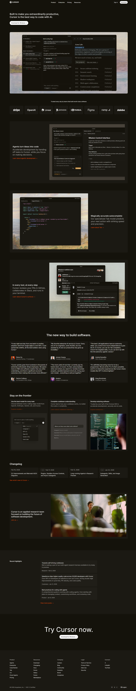

# Cursor Landing Page

A desktop-first developer tool landing page inspired by the Cursor website.  
Built using **only HTML and CSS** (No JavaScript, No TailwindCSS, No frameworks).

**Assignment:** Chai Aur Code

---

## ✨ Sections Included

- Top Navigation Bar
- Hero Section
- Trusted By (Logos)
- 3 Feature Sections (Alternating Layout)
- Feature Cards Grid
- Testimonials (6 Cards)
- Changelog / Updates
- Team / Join Us Section
- Blog Highlights
- Final CTA
- Footer (5-column layout)

---

## 🛠 Tech Stack

- HTML5 (Semantic Tags)
- CSS3 (Flexbox + Grid)
- Google Fonts (Inter)

No JavaScript.  
No CSS Frameworks.  
Desktop-only layout.

---

## 📂 Project Structure

```
Cursor-Landing-Page/
│
├── index.html
├── style.css
├── assets/
└── README.md
```

---

## 🚀 How to Run

```bash
git clone https://github.com/VinayakLambade22/Cursor-Landing-Page.git
cd Cursor-Landing-Page
```

**Open the HTML file**

- Navigate to the project directory
- Double-click `index.html` to open in your default browser
- Or right-click → Open with → Choose your preferred browser

---

## 📸 Screenshots



## 🌐 Live Demo

## **Live Website:** [Cursor-Landing-Page](https://cursor-landing-page-liart.vercel.app/)

## 📧 Contact

If you have any questions or would like to connect, please feel free to reach out.

<p align="left">
  <a href="https://linkedin.com/in/vinayaklambade" target="_blank">
    
  </a>
</p>

## 📄 License

## This project is open source and available for personal and educational use.
